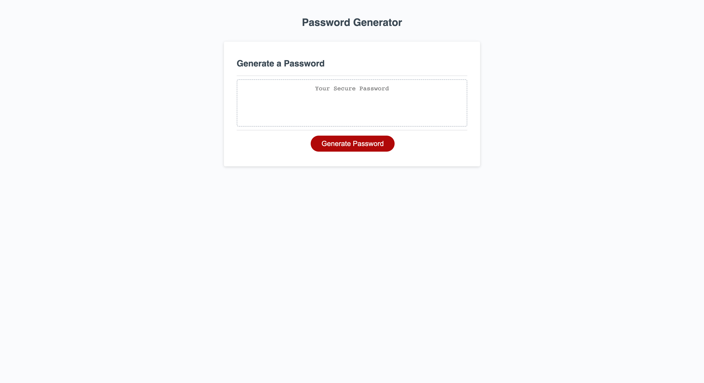

## Random Password Generator

# Description

Many consumers set simple passwords to guard sensitive information that hackers can easily crack. To combat the issue, this program will generate a random password using a user-selected combination of uppercase and lowercase letters, numbers, and/or special characters between 8 and 128 characters, yielding a very strong password that is harder to crack. Building this project reenforces basic Javascript concepts of variable assignment, conditional statements, for loops, and random string character generation. 

# Installation

N/A

# Usage

Click the button, "Generate Password," then type an integer signifying a password length between (and including) 8 and 128 characters. Next, select at least one character type. Writing a password length less than 8 characters or greater than 128 characters, or not selecting any character types, will cause the program to run through the prompts again, until the password criteria are met. 

The application can be accessed here: https://lyubomirg1995.github.io/password-generator/

# Credits

---Knowledge base---

Functions: https://javascript.info/function-basics

Function expressions: https://javascript.info/function-expressions

Logical operators: https://javascript.info/logical-operators

Comparisons: https://javascript.info/comparison

for loops: https://javascript.info/while-for#the-for-loop

Concatenation: https://javascript.info/operators

---Techniques---

Invalid conditions, if statements for character types: AskBCS Learning Assistant, skaliaperumal, and Chris Baird (tutor)

Object data storage syntax shorthand: https://developer.mozilla.org/en-US/docs/Web/JavaScript/Reference/Operators/Object_initializer#property_definitions 
                        
  https://javascript.plainenglish.io/object-literals-using-object-property-shorthand-6360825c60ef

for loop/random string generation: https://dev.to/code_mystery/random-password-generator-using-javascript-6a + Chris Baird (tutor)

